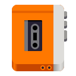
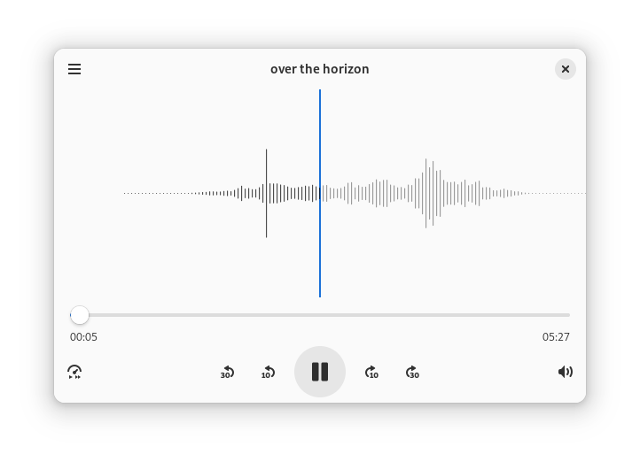
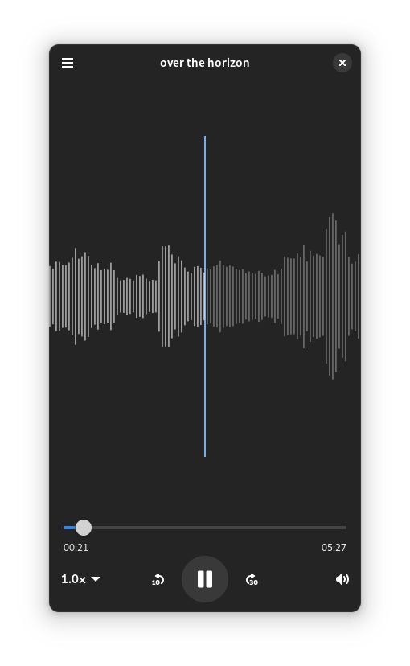

# Decibels

Play audio files.

> Note: This app is still in development, and may not be stable.

## Installing

### Flathub

Coming Soon

### From Nightly Flatpak

Download latest artifact [from here][artifact].

## Links

- [Audio Player app: issue by Allan Day](https://gitlab.gnome.org/Teams/Design/app-mockups/-/issues/96)
- [Audio Player mockups](https://gitlab.gnome.org/Teams/Design/app-mockups/-/blob/master/audio-player/audio-player.png?ref_type=heads)

[artifact]: https://github.com/vixalien/decibels/actions/workflows/build-nightly.yml
